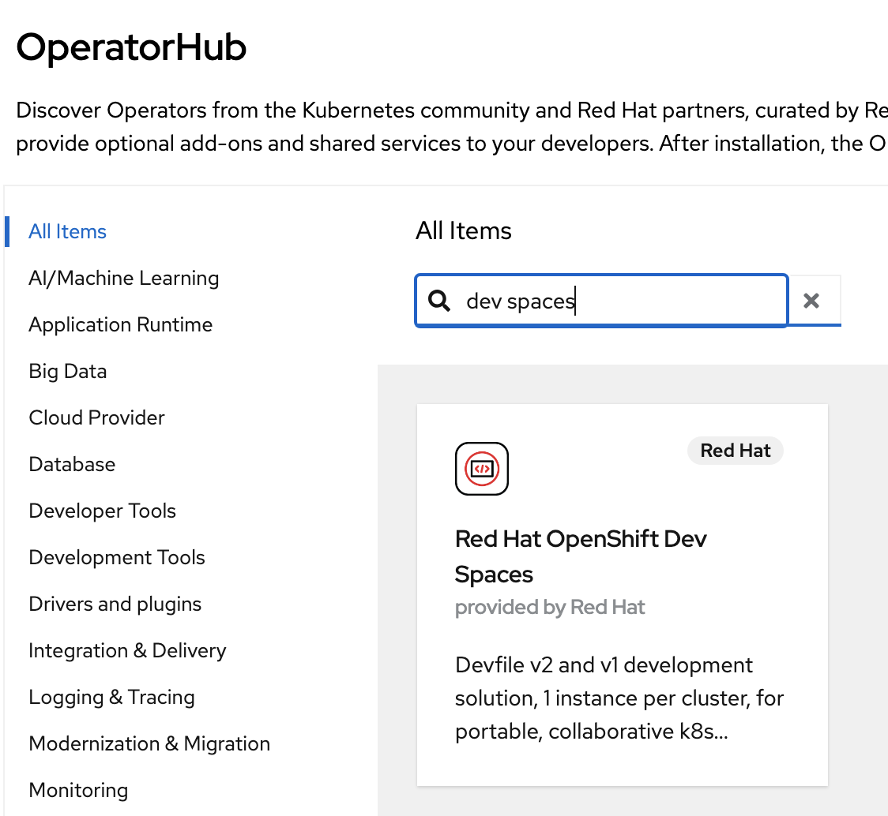
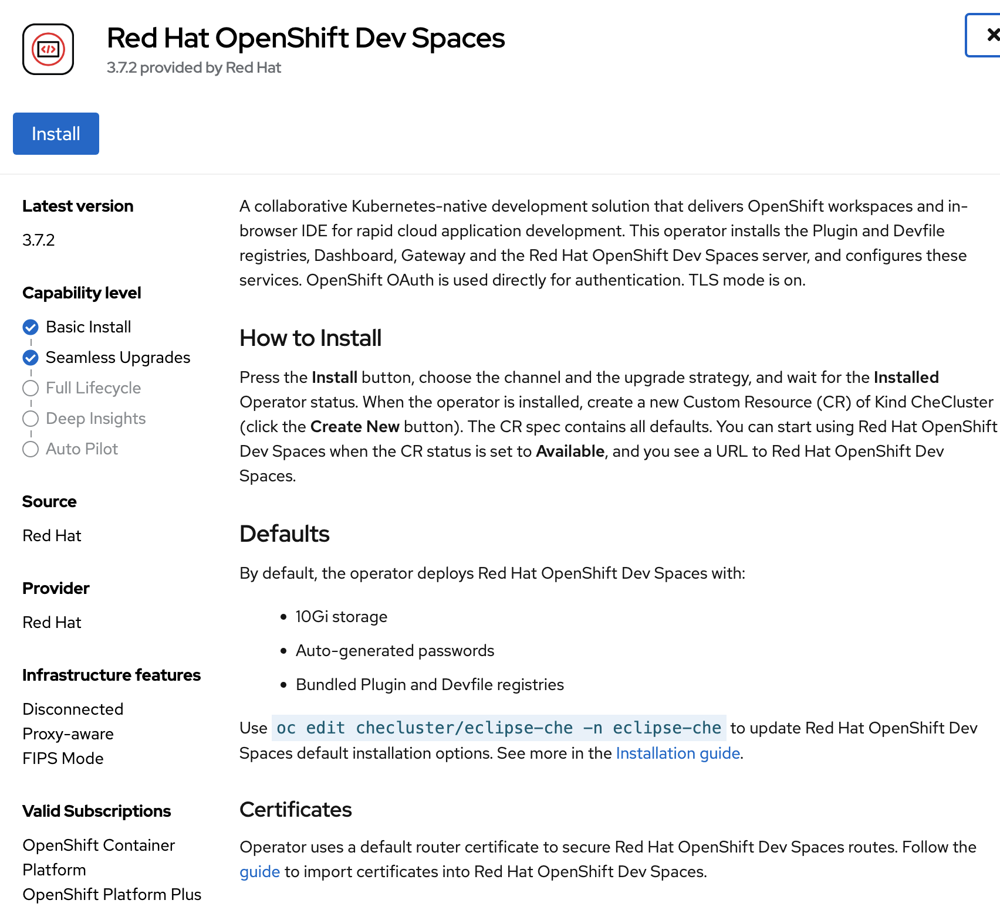
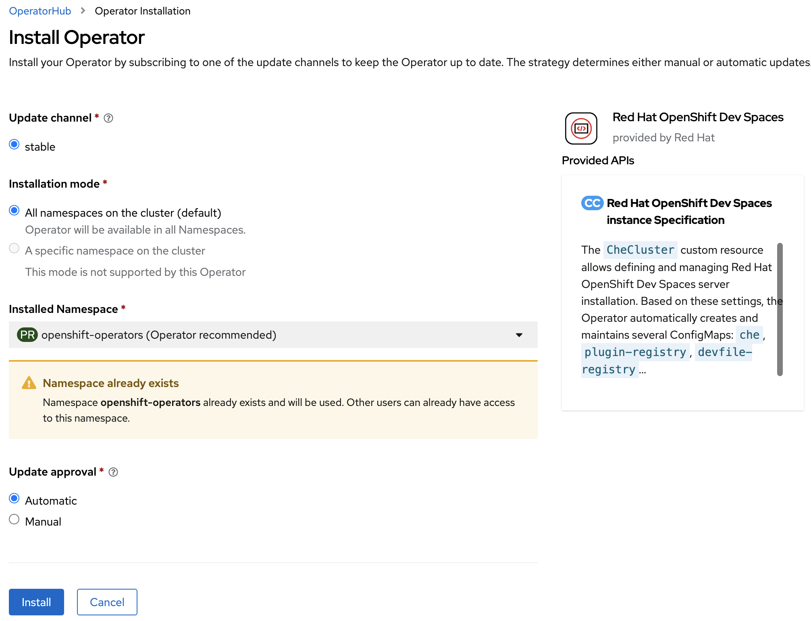
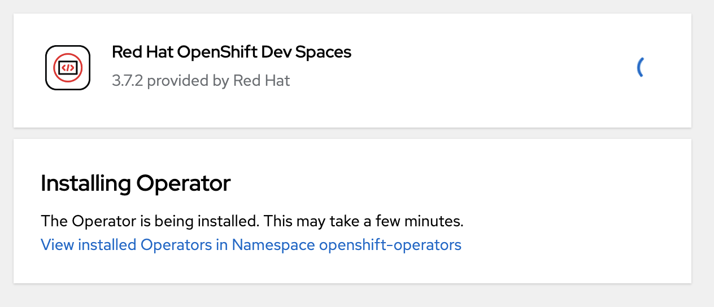
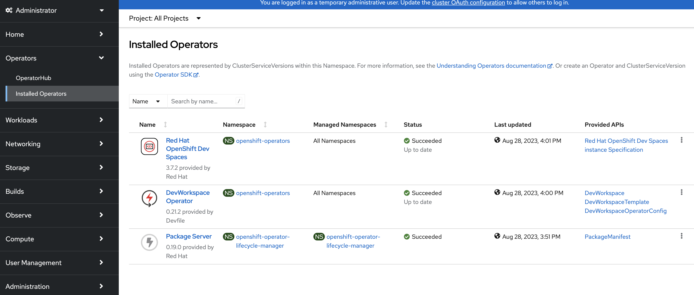
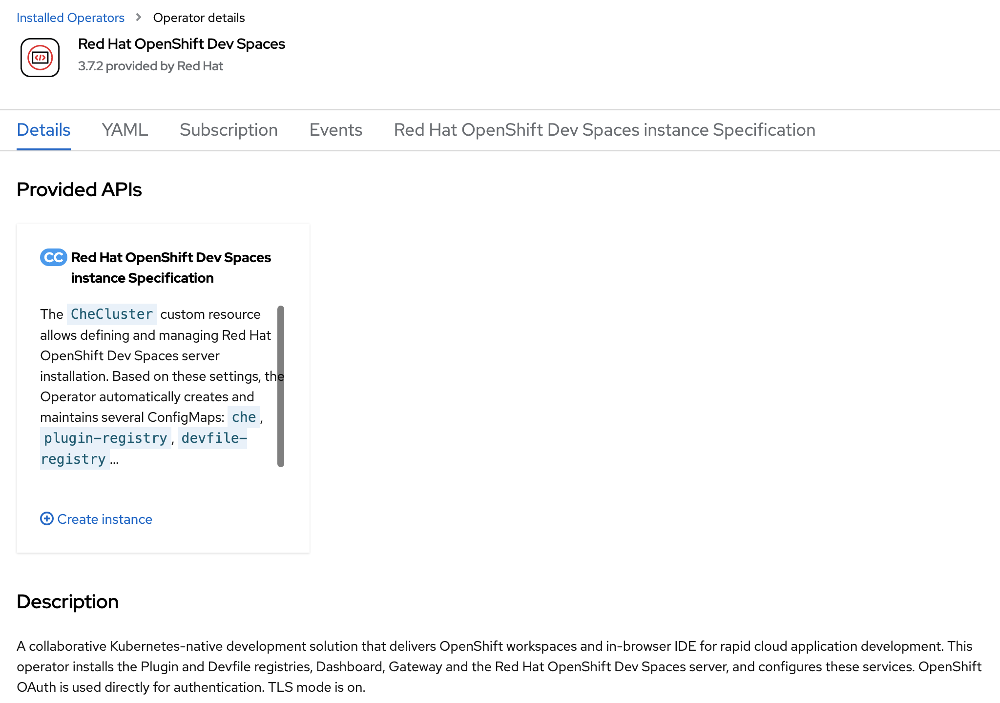
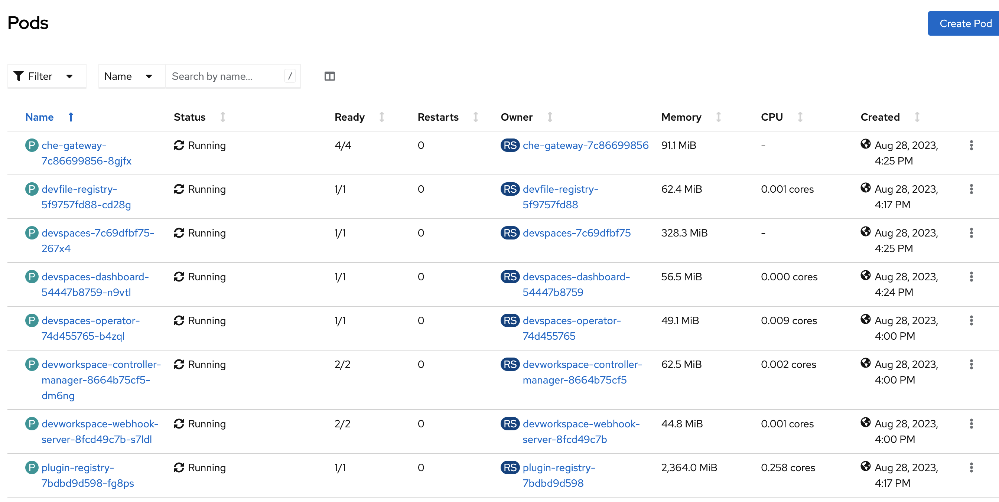

# Day 0 - Project Pre-Reqs and Setup

## CheCluster Setup and Configuration

### Manual set up

1- Get an access to an OpenShift cluster (RHPDS if needed) 

2- In the OpenShift web console from the operator hub, search and install the Dev Spaces operator as an administrator

Click on the "Install" button

You may leave the default set up or change them depending on your cluster requirements

Click on the "Install" button, and the installation will start

After a few minutes, you will see the new Dev Spaces operator installed

3- Create an instance of the Dev Spaces

You may leave the default configuration, or change according to your need (eg log level, metrics, etc.)
Click on the "Create" button
In the "Workload > Pods" section, you can see several pods being created. This may take a few minutes.

> Note: If you want this to be available to other users (which you likely do!), then you need to either a) deploy this to a namespace where others will have access, or b) adjust user access to the default-install namespace.

### Automated installation

For an automated installation, the OpenShift CLI must be set up. This will allow to use the `oc` command.

Make sure you download the CLI version that matches the OpenShift version you will be using. 

Check out the CLI command reference guide: https://docs.openshift.com/container-platform/4.13/cli_reference/openshift_cli/developer-cli-commands.html

Three steps are required:
    1- Install the Dev Spaces operator
    2- Create an instance of Dev Spaces
    3- Create a Workspace using the parent app project which contains the required information about other projects included in the workspace

# Recommendations and Best Practices

- What kind of image to use for the Dev Spaces workspace?

    1- Using the default, named "Universal Default Image". In that case, no need to have the `components` defined in the devfile.yaml.

    - Pros
        - Nothing to do
    - Cons
        - Large image (> 10GB)

    2- Build a custom image. The `devfile.yaml` file needs to include a component that points to the image to be used. For instance, the following one: `quay.io/cgruver0/che/che-demo-app:latest`.
    A `VSCODE_DEFAULT_WORKSPACE` property with a value set to the desired workspace (eg `/projects/che-demo-app/che-demo.code-workspace`) needs to be added to the container for that component. If no custom image is being used, then this env variable cannot be set and when VSCode is started, an extra step is needed to click on "Open Workspace" (bottom-right of the IDE).    
    An example on how to build a custom image can be found here: https://github.com/eclipse-che-demo-app/che-demo-app/blob/main/images/build.sh

    - Pros 
        - Smaller size image
        - Customized image for the exact tools needed
        - Upgrades are easy if new versions or new tools are to be added
    - Cons 
        - More steps to create and maintain the script
        - Needs to be stored somewhere (Quay?)
        - Need to set up the script(s)

- OAuth is the recommended way to go regarding security and credentials.  Using `ConfigMap` and secrets is not as good. 

    - Pros 
        - More enterprise-ready
    - Cons
        - Requires an OAuth admin to create clientID
        - Requires additional expertise

Useful link about OAuth: https://access.redhat.com/documentation/en-us/red_hat_openshift_dev_spaces/3.7/html/administration_guide/configuring-devspaces#configuring-oauth-2-for-github

- Automation
It is recommended to automate the provisionning of the Dev Spaces environments.  
GitOps and ArgoCD may be used for this.

- Do not use the DSC CLI

- If the devfile points to restricted github repo, then an OAuth ID is needed

