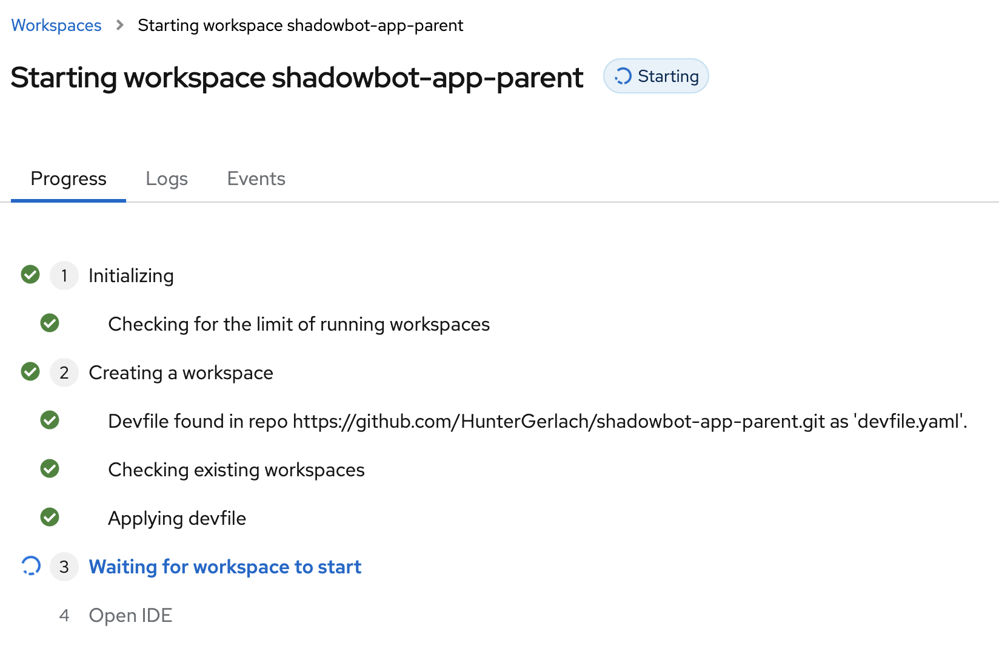

# Day 1

## Configure Project/Workspace

1. Once all pods are up and running, using a non-administrator role, click "Dev Spaces" in the 9-square menu (top-right corner)


2. This will ask you to login


3. Authorize all access


You will access to Dev Spaces landing page

## Create GitHub Personal Access Token

1. Visit Github

2. Go to Settings -> Developer Settings

3. Create a Personal Access Token (Fine-grained)

4. Select your desired preferences (I limited scope to just the lone repo)


5. Copy your token for use in the next section.

## Add GitHub Token

1. Go to the top of the Dev Spaces home screen and visit User Preferences


2. Visit the Personal Access Tokens section


3. Click "Add Token" and input credentials for your GitHub Personal Access Token that you obtained earlier.


4. Click "Add" to finish the setup process. Move on to setting up the repository workspace.

## Import and Configure the Project

4. Import the `shadowbot-app-parent` project using the following URL: https://github.com/HunterGerlach/shadowbot-app-parent.git


The workspace is being created, this may takes a few minutes to complete



5. VS Code should now be up and running in your Dev Sapces environment
Click on the "Open Workspace" button on the bottom right. (This step is required if the `VSCODE_DEFAULT_WORKSPACE` is not set in the devfile.)
An image for a specific container will be created in the future where this property will be set.
You should now see the projects identified to be part of the workspace


Your workspace is ready to use.

## Mount Configs and Secrets

You can now run general commands and perform minimal coding tasks, but more complex activities (e.g. running the application) will require you to have configurations and secrets available for your application to consume. We outline the steps to getting those mounted below...


### Mount Configmap

1. Obtain the login token

2. Open the terminal

3. Navigate to the deployment directory: `cd /projects/deep-thought/deployments`

4. Take a look at the configmap.yaml file in the editor to ensure there's nothing you need/want to change. Save any changes you make.

5. `oc` is installed by default, so run the folowing command to add the configmap to your namespace: `oc apply -f configmap.yaml -n YOUR_NAMESPACE`. The configmap should have two labels and an annotation applied that allow OpenShift Dev Spaces to automatically pick it up.

> Note: Your workspace will liely restart once the reconciliation loop completes here, so don't be in a rush to make new changes for they might not be saved.

6. Once the workspace restarts, confirm that the configs have been properly added to the container via: `echo $MODEL_PROVIDER`. You should see a result that matches the value in the configmap.yaml.

### Mount Secrets

> Note: You can likely skip steps 1-3 assuming you are immediately continuing from the section above, though your token may need to be reset.

There are two secrets we need to add for the application to work properly: the secrets.yaml and the google-application-credentials.yaml. We'll start with the secrets.yaml.

1. Obtain the login token

2. Open the terminal

3. Navigate to the deployment directory: `cd /projects/deep-thought/deployments`

4. Take a look at the secrets.yaml file in the editor. Secrets are obtained from the team Bitwarden collection. You should have been given access to them when you onboarded. You need to encode each secret in base64 format prior to adding to the secrets.yaml file. To do this, run the fololowing:

```sh
echo -n "<secret-value>" | base64 | tr -d '\n'
```

For secrets that exist in files you can run something like the following:

```sh
echo -n $(cat <FILE_LOCATION>) | base64 | tr -d '\n'
```

Copy/paste the result in the appropriate line in the secrets.yaml file.

5. As stated earlier `oc` is installed by default, so run the folowing command to add the secrets file to your namespace: `oc apply -f secrets.yaml -n YOUR_NAMESPACE`. The secret should have two labels and an annotation applied that allow OpenShift Dev Spaces to automatically pick it up.

> Note: Your workspace will liely restart once the reconciliation loop completes here, so don't be in a rush to make new changes for they might not be saved.

6. Once the workspace restarts, feel free to confirm that the secrets have been properly added to the container via: `echo $CONNECTION_STRING`, but note this will output the secret to the terminal so use caution running this. You should see a result that matches the value in the secrets.yaml.

7. Repeat steps 4-6 for google-application-credentials.yaml.

8. If the configs/secrets aren't showing up for some reason, be sure to restart the workspace.
