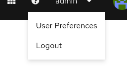
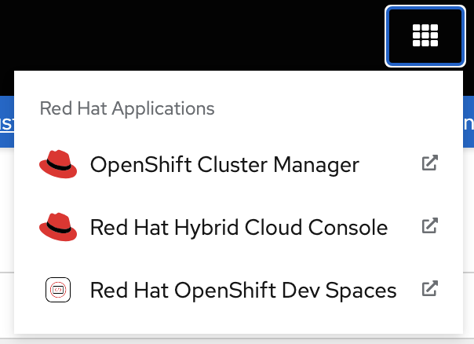
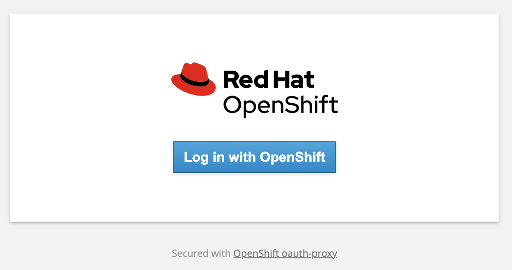
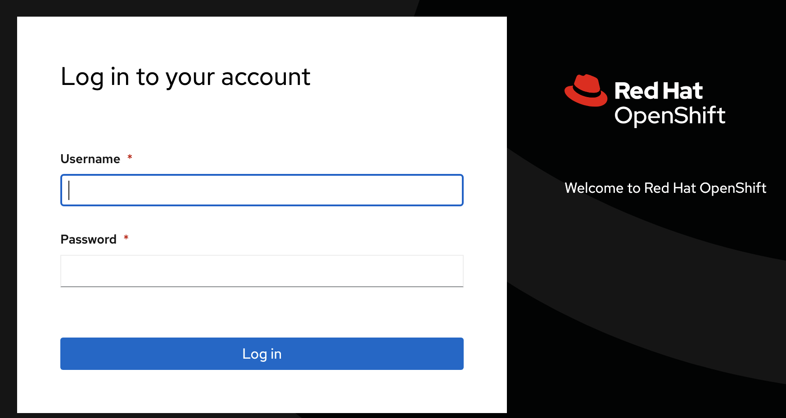
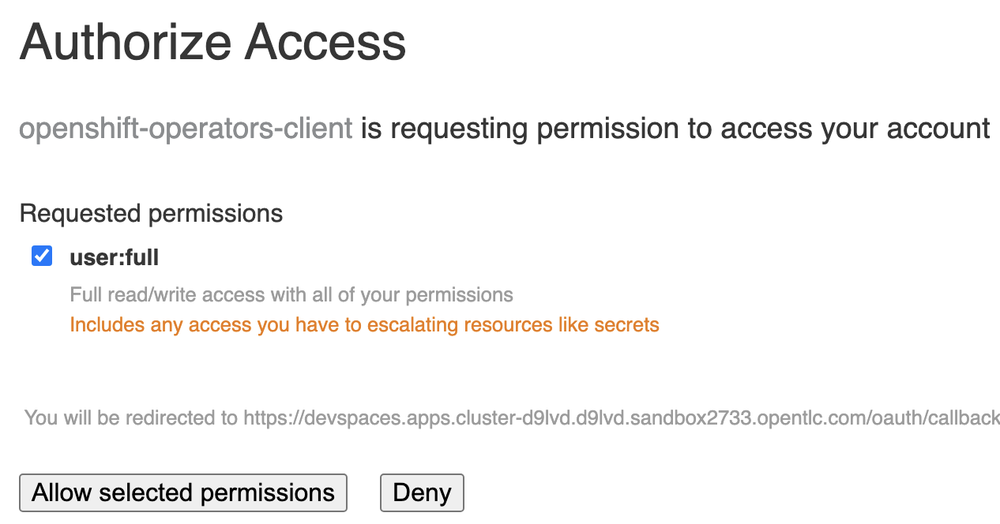
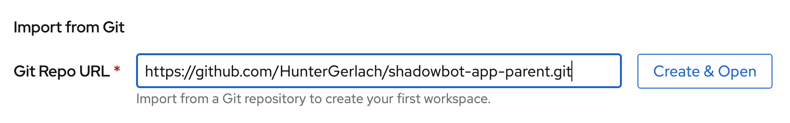
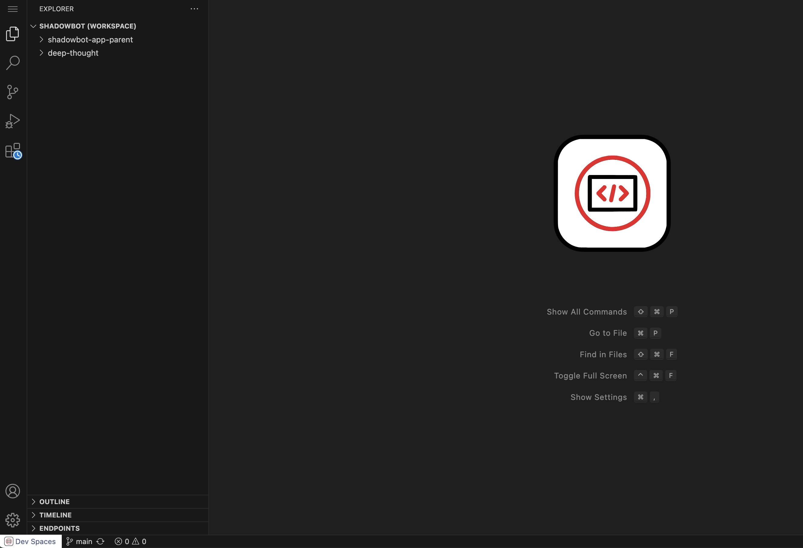

# Day 1

## Create GitHub Personal Access Token

1. Visit Github

2. Go to Settings -> Developer Settings

3. Create a Personal Access Token (Fine-grained)

4. Select your desired preferences (I limited scope to just the lone repo)

5. Copy your token for use in the next section.

## Add GitHub Token

1. Go to the top of the Dev Spaces home screen and visit User Preferences

2. Visit the Personal Access Tokens section

3. Click "Add Token" and input credentials for your GitHub Personal Access Token that you obtained earlier.

4. Click "Add" to finish the setup process. Move on to setting up the repository workspace.

## Configure Project/Workspace

1. Once all pods are up and running, using a non-administrator role, click "Dev Spaces" in the 9-square menu (top-right corner)

2. This will ask you to login

3. Authorize all access

You will access to Dev Spaces landing page

4. Import the `shadowbot-app-parent` project using the following URL: https://github.com/HunterGerlach/shadowbot-app-parent.git

The workspace is being created, this may takes a few minutes to complete

5. VS Code should now be up and running in your Dev Sapces environment
Click on the "Open Workspace" button on the bottom right. This step is required if the `VSCODE_DEFAULT_WORKSPACE` is not set in the devfile.
An image for a specific container will be created in the future where this property will be set.
You should now see the projects identified to be part of the workspace

Your workspace is ready to use.
